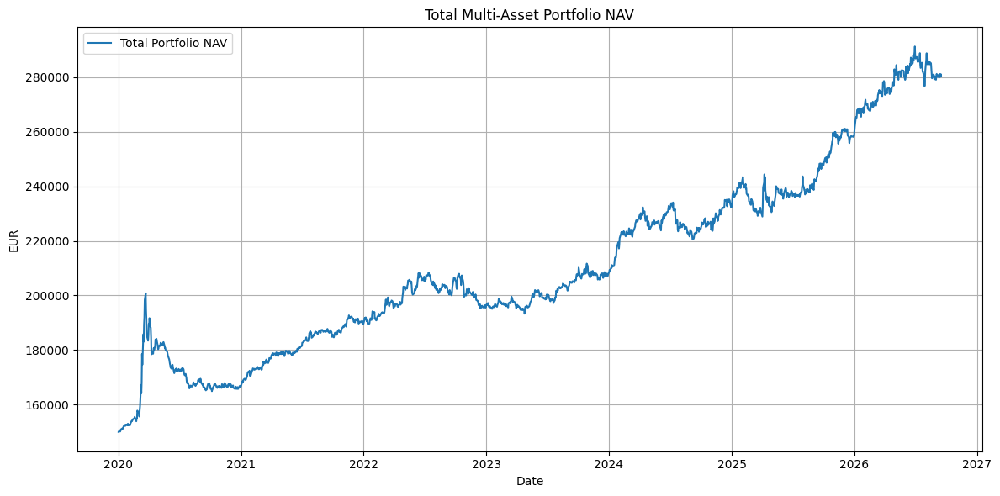
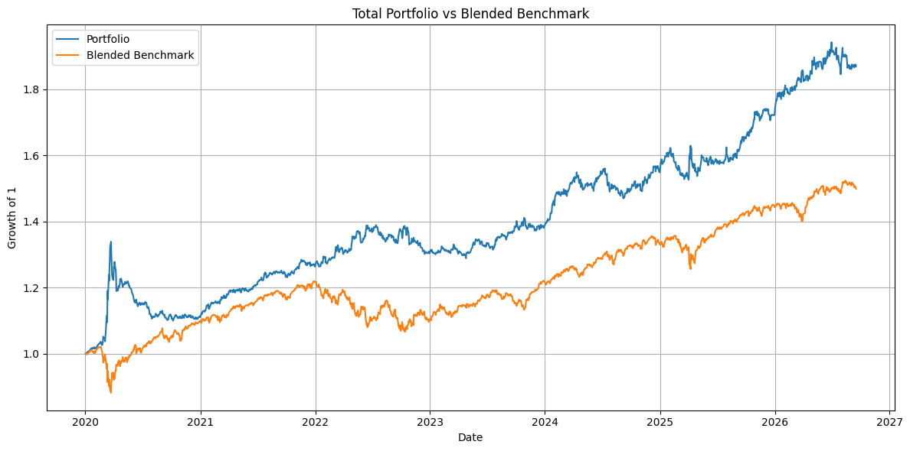
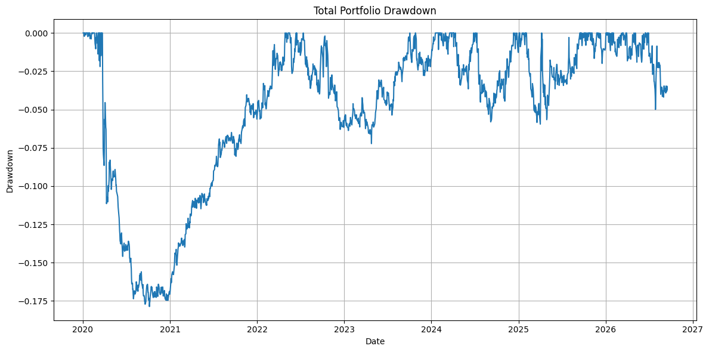
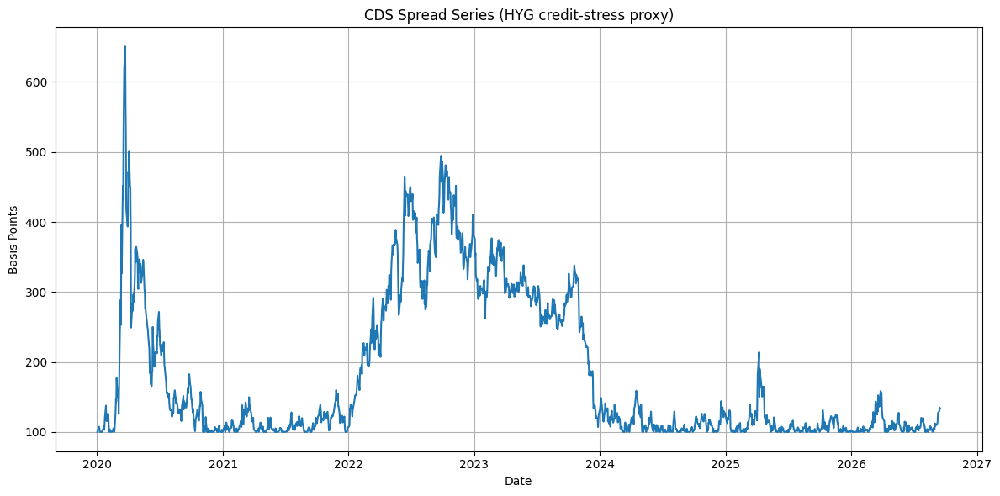
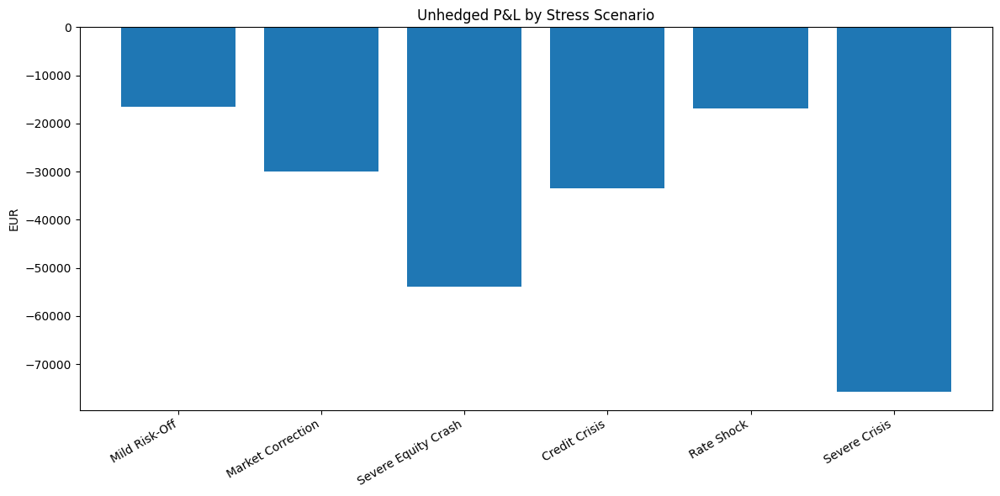
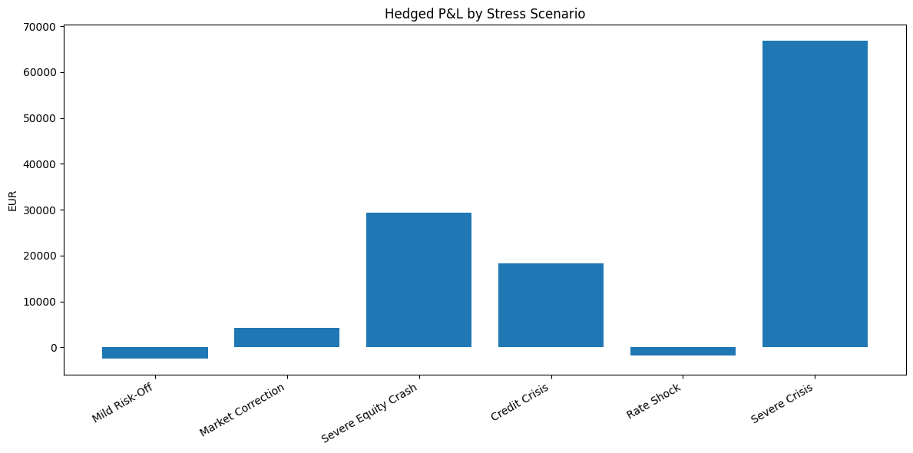
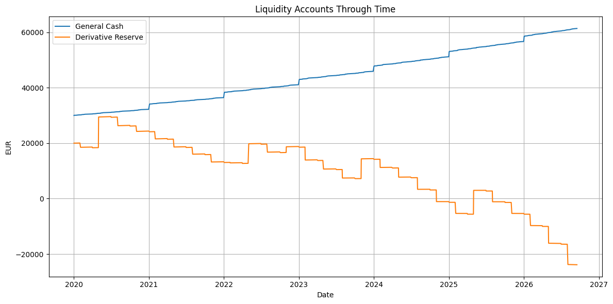

# Multi-Asset Portfolio Risk & Stress Testing Engine

## Historical Portfolio Backtest, Hedging, Credit Risk and Liquidity Analysis

**Initial Capital:** EUR 150,000  
**Latest model run:** 16 September 2026

---

## Abstract

This project develops a Python-based multi-asset portfolio engine combining portfolio valuation, performance measurement, benchmark analysis, derivative hedging, credit-risk modelling, liquidity monitoring and stress testing in a unified framework.

The portfolio begins with **EUR 150,000** allocated across equities, bonds, a dedicated derivatives reserve and general cash. The equity sleeve contains eleven listed companies and is valued in EUR using EUR/USD conversion. The bond sleeve is approximated using duration and convexity, while a rolling SPY put programme provides downside protection.

A CDS-style protection position is valued using either actual supplied spreads or, in the current version, an explicitly labelled **HYG-based credit-stress proxy**.

The engine also calculates:

- Historical VaR and Expected Shortfall
- Sharpe and Sortino ratios
- Maximum drawdown
- Tracking error and information ratios
- CAPM beta and alpha
- CVA
- Six deterministic multi-asset stress scenarios
- Risk-limit breaches and liquidity controls

The latest run produced a current NAV of **EUR 280,474.81**, annualized return of **9.76%**, annualized volatility of **8.95%**, a Sharpe ratio of **0.70**, a Sortino ratio of **1.13**, and a maximum drawdown of **-17.87%**.

Three risk controls were triggered:

- Maximum drawdown limit breached
- Single-stock concentration limit breached
- Derivative reserve exhausted

---

# 1. Project Objective

The objective is to demonstrate how a multi-asset portfolio can be monitored from both a performance and risk perspective.

The model is designed to show not only portfolio growth, but also:

- where risk accumulates
- how hedge behaviour changes under stress
- whether liquidity remains adequate
- whether predefined risk limits are breached

The framework aims to:

- Measure total portfolio performance and risk
- Compare the portfolio with equity and blended benchmarks
- Model option hedging and CDS-style credit protection
- Track separate general-cash and derivative-reserve accounts
- Run deterministic multi-asset stress tests
- Apply explicit model controls and risk triggers

---

# 2. Portfolio Architecture

| Sleeve | Initial Capital | Initial Weight |
|---|---:|---:|
| Equities | EUR 60,000 | 40.00% |
| Bonds | EUR 40,000 | 26.67% |
| Derivative Reserve | EUR 20,000 | 13.33% |
| General Cash | EUR 30,000 | 20.00% |
| **Total** | **EUR 150,000** | **100.00%** |

## 2.1 Equity Sleeve

The equity book is fixed exogenously. It is therefore a **portfolio backtest**, not a walk-forward stock-selection model and not evidence of ex-ante security-selection skill.

| Ticker | Initial EUR Allocation |
|---|---:|
| MSFT | EUR 7,000 |
| GOOGL | EUR 7,000 |
| AMZN | EUR 6,000 |
| JPM | EUR 6,000 |
| V | EUR 5,000 |
| ASML | EUR 5,000 |
| XOM | EUR 5,000 |
| JNJ | EUR 5,000 |
| PG | EUR 4,000 |
| CAT | EUR 5,000 |
| META | EUR 5,000 |

Shares are determined from each EUR allocation, the initial USD market price and the EUR/USD exchange rate.

Subsequent daily market values are translated back to EUR:

> **Equity value in EUR = USD price × shares / EURUSD**

## 2.2 Bond Sleeve

The bond sleeve contains four synthetic bonds, each with an initial market value of **EUR 10,000**.

The model uses a duration-convexity approximation driven by daily changes in the `^TNX` yield proxy rather than full security-level discounted cash-flow pricing.

| Bond | Coupon | Initial Price | Modified Duration | Convexity |
|---|---:|---:|---:|---:|
| A | 4.2% | 99.0 | 3.5 | 18.0 |
| B | 4.8% | 101.5 | 5.2 | 30.0 |
| C | 5.1% | 97.5 | 6.0 | 39.0 |
| D | 4.4% | 100.2 | 4.1 | 23.0 |

Approximate bond price change:

> **ΔP ≈ - Modified Duration × Δy + 0.5 × Convexity × (Δy)^2**

Annual coupon cash flows are credited to the general cash account.

## 2.3 Cash and Funding

**General Cash**

- Starts at EUR 30,000
- Earns 3.5%
- Receives dividends and bond coupons

**Derivative Reserve**

- Starts at EUR 20,000
- Earns 3.0%
- Funds option and CDS premium cash flows
- Is permitted to become negative so underfunding remains visible rather than hidden

---

# 3. Data Sources and Data Treatment

The model downloads market data with `yfinance`.

Market inputs include:

- 11 equity tickers
- SPY
- EURUSD=X
- ^TNX
- HYG
- ^GSPC

Price downloads use:

```python
auto_adjust=True
```

A missing-data report is run before valuation forward-fill.

In the latest execution, all eleven equities had **1,685 available observations and zero missing observations**.

Forward filling is used for valuation alignment, while raw return calculations use:

```python
pct_change(fill_method=None)
```

Actual dividend histories are retrieved separately and converted to EUR at the corresponding EUR/USD rate before being credited to the general cash ledger.

---

# 4. Option Hedge Methodology

The model uses rolling SPY put options to hedge portfolio equity risk.

Main assumptions:

- Put moneyness: **95%**
- Tenor: **6 months**
- Roll frequency: **every 3 months**
- Target hedge ratio: **50% of beta-adjusted equity exposure**
- Option multiplier: **100**
- Rolling volatility lookback: **63 trading days**
- Rolling beta lookback: **126 trading days**
- Volatility bounds: **12% to 150%**
- Beta bounds: **0.25 to 2.00**

Option values, delta and gamma are calculated using **Black-Scholes**.

The number of contracts is rounded upward to ensure the target hedge is met or exceeded.

No arbitrary contract cap is applied. If premium spending exceeds the derivative reserve, the model flags the funding shortfall.

---

# 5. CDS and Counterparty Risk Methodology

The CDS-style position uses:

- Notional: **EUR 100,000**
- Recovery rate: **40%**
- Maturity: **5 years**

> **Important:** No observed CDS market-history dataset is used in the current version. The CDS spread series is a modelling proxy derived from HYG price drawdowns and is used for educational credit-risk and stress-testing purposes.

The proxy spread is clipped between **75 and 750 bps**.

The contractual coupon is set equal to the inception spread so that inception MTM is approximately zero.

Hazard-rate approximation:

> **Hazard rate = market spread / (1 - recovery)**

The model discounts quarterly premium and protection legs using a fixed **3.5% risk-free rate**.

CVA is applied to positive current CDS exposure using:

- Counterparty PD: **2%**
- Counterparty recovery: **40%**

> **CVA = positive exposure × PD × (1 - counterparty recovery)**

---

# 6. Risk Metrics

The total portfolio return series is generated from unified NAV.

The reported annualized total return is the arithmetic mean daily return multiplied by 252; **it is not a geometric CAGR**.

Metrics include:

- Annualized return
- Annualized volatility
- Sharpe ratio
- Sortino ratio
- 99% Historical VaR
- 99% Historical Expected Shortfall
- Maximum drawdown
- Tracking error
- Information ratio
- CAPM beta and alpha

---

# 7. Benchmark Framework

The equity sleeve is compared with the **S&P 500 (`^GSPC`)**.

The analysis calculates:

- Tracking error
- Information ratio
- Beta
- CAPM alpha

The total portfolio is compared with a blended benchmark using the initial portfolio weights:

- 40.00% S&P 500
- 26.67% modelled bond sleeve
- 20.00% general cash
- 13.33% derivative-reserve return

---

# 8. Model Controls and Validation

The model includes explicit checks:

- Equity allocations must sum to EUR 60,000
- Bond allocations must sum to EUR 40,000
- Initial total NAV must reconcile to EUR 150,000
- Missing observations are reported before forward filling
- Raw return calculations disable automatic forward filling
- General cash and derivative reserve are maintained separately
- Maximum drawdown is compared with a -15% risk limit
- 99% VaR / NAV is compared with a 5% limit
- Maximum single-stock weight is compared with a 15% limit
- General cash / NAV is compared with a 10% minimum buffer
- A negative derivative reserve triggers a reserve-exhaustion flag
- Current and stressed option delta, gamma and effective hedge ratios are reported
- CDS-only stress is separated from full multi-asset stress testing

---

# 9. Latest Model Dashboard

| Metric | Latest Output |
|---|---:|
| Target Initial Capital | EUR 150,000.00 |
| Actual Initial NAV | EUR 150,000.00 |
| Current Total NAV | EUR 280,474.81 |
| Current Equity NAV | EUR 201,917.30 |
| Current Bond NAV | EUR 34,600.69 |
| Current Option MTM | EUR 4,993.55 |
| Current CDS MTM | EUR 1,452.19 |
| Current General Cash | EUR 61,375.82 |
| Current Derivative Reserve | EUR -23,864.74 |
| Total Liquid Cash | EUR 37,511.08 |
| Dividends Received | EUR 9,814.41 |
| Bond Coupons Received | EUR 11,156.09 |
| CDS Premiums Paid | EUR 6,500.00 |
| Annualized Total Return | 9.76% |
| Annualized Total Volatility | 8.95% |
| Sharpe Ratio | 0.70 |
| Sortino Ratio | 1.13 |
| 99% Historical VaR | EUR 3,606.84 |
| 99% Historical ES | EUR 5,418.41 |
| Maximum Drawdown | -17.87% |
| Equity Tracking Error | 10.28% |
| Equity Information Ratio | 0.61 |
| Equity Beta vs S&P 500 | 1.03 |
| Equity CAPM Alpha | 5.87% |
| Total Tracking Error vs Blended Benchmark | 13.52% |
| Total Information Ratio vs Blended Benchmark | 0.25 |
| Current Put Contracts | 9 |
| Current Put Delta | -0.1989 |
| Current Put Gamma | 0.005005 |
| Current Effective Hedge Ratio | 50.22% |
| Target Hedge Ratio | 50.00% |
| Current CDS Spread | 133.5 bps |
| CDS Contract Coupon | 100.0 bps |
| Current CDS Exposure | EUR 1,452.19 |
| CVA | EUR 17.43 |
| Credit-Adjusted CDS | EUR 1,434.76 |

---

# 10. Interpretation of Results

## 10.1 Portfolio Growth

The portfolio increased from **EUR 150,000 to EUR 280,474.81**.

The NAV path includes the 2020 sell-off, a prolonged recovery and later growth.

Because total NAV includes cash, bonds, options and CDS MTM, the path should not be interpreted as a pure equity return series.



## 10.2 Risk-Adjusted Performance

The **9.76% annualized arithmetic return** and **8.95% annualized volatility** produce a Sharpe ratio of **0.70**.

The Sortino ratio of **1.13** reflects downside-only volatility.

These measures describe historical sample performance and do not establish future performance.

## 10.3 Benchmark-Relative Performance

The equity sleeve has beta **1.03** versus the S&P 500.

The **5.87% CAPM alpha** and **0.61 equity information ratio** describe positive historical active performance.

Because the stock book is fixed exogenously, these statistics should not be interpreted as proof of a repeatable stock-selection process.

At total-portfolio level:

- Tracking error: **13.52%**
- Information ratio: **0.25**



## 10.4 Tail Risk and Drawdown

The 99% Historical VaR of **EUR 3,606.84** is about **1.29% of current NAV**, remaining below the 5% VaR limit.

Expected Shortfall is **EUR 5,418.41**.

Maximum drawdown is **-17.87%**, exceeding the model's **-15% drawdown limit**.



## 10.5 Equity Concentration

GOOGL is the largest current equity position at **17.05%** of the equity sleeve and breaches the 15% single-stock limit.

The next largest positions are:

- CAT: 14.27%
- ASML: 13.51%

The concentration drift arises because the equity holdings are not periodically rebalanced.

---

# 11. CDS Results

The current CDS proxy spread is **133.5 bps** versus a **100 bps contractual coupon**.

Current CDS MTM:

**EUR 1,452.19**

After a simplified CVA charge of **EUR 17.43**, the credit-adjusted CDS value is:

**EUR 1,434.76**

The HYG-based proxy shows large stress spikes during 2020 and later credit-risk episodes.

It must be interpreted as a **credit-stress indicator rather than actual CDS history**.



## 11.1 CDS-Only Stress Test

| Stressed Spread | CDS MTM | P&L vs Current |
|---|---:|---:|
| 50.0 bps | EUR -2,242.36 | EUR -3,694.55 |
| 133.5 bps | EUR 1,452.19 | EUR 0.00 |
| 233.5 bps | EUR 5,566.21 | EUR 4,114.02 |
| 383.5 bps | EUR 11,155.02 | EUR 9,702.83 |
| 633.5 bps | EUR 19,112.14 | EUR 17,659.95 |

The direction of the stress test is consistent with a protection-buyer position: tighter spreads reduce MTM and wider spreads increase the value of protection.

---

# 12. Multi-Asset Stress Testing

The stress framework combines:

- Equity shocks
- Interest-rate shocks
- Credit-spread shocks
- Volatility shocks
- FX shocks

Options are repriced under stressed spot and volatility.

Bonds use duration-convexity.

CDS is repriced under stressed spreads.

| Scenario | Equity P&L | Bond P&L | Option P&L | CDS P&L | Hedged P&L |
|---|---:|---:|---:|---:|---:|
| Mild Risk-Off | EUR -15,683 | EUR -796 | EUR +11,912 | EUR +2,098 | EUR -2,469 |
| Market Correction | EUR -28,845 | EUR -1,185 | EUR +30,083 | EUR +4,114 | EUR +4,166 |
| Severe Equity Crash | EUR -52,349 | EUR -1,569 | EUR +75,334 | EUR +7,913 | EUR +29,329 |
| Credit Crisis | EUR -32,691 | EUR -796 | EUR +40,300 | EUR +11,423 | EUR +18,235 |
| Rate Shock | EUR -13,857 | EUR -3,043 | EUR +12,078 | EUR +3,116 | EUR -1,706 |
| Severe Crisis | EUR -73,424 | EUR -2,318 | EUR +124,924 | EUR +17,660 | EUR +66,842 |

## Unhedged P&L



## Hedged P&L



## 12.1 Scenario Interpretation

**Mild Risk-Off:**  
The hedge offsets most of the unhedged loss, but the portfolio remains slightly negative. The stressed hedge ratio rises to about 112%.

**Market Correction:**  
Option and CDS gains more than offset the unhedged loss, producing a small positive hedged result. The stressed hedge ratio rises to about 164%.

**Severe Equity Crash:**  
The nonlinear put response dominates. The portfolio moves from roughly EUR -53.9k unhedged to EUR +29.3k hedged, while the hedge ratio rises above 223%.

**Credit Crisis:**  
Both option and CDS protection contribute strongly. The result becomes positive despite a substantial underlying equity loss.

**Rate Shock:**  
Bond losses are largest in this scenario. Hedge gains soften the loss, but the total result remains slightly negative.

**Severe Crisis:**  
The model produces a very large positive hedged result of about EUR 66.8k.

The effective hedge ratio reaches roughly **246%**, indicating material over-hedging caused by option convexity.

This is a **model-risk finding**, not evidence that the portfolio would reliably profit in a real crisis.

---

# 13. Liquidity and Funding

General cash grows to **EUR 61,375.82** through interest, dividends and bond coupons.

The derivative reserve declines to **EUR -23,864.74** because rolling option and CDS premium costs exceed the dedicated funding sleeve.

Total liquid cash remains positive at **EUR 37,511.08**, but the dedicated derivatives budget is exhausted.



This distinction is important:

> A hedge can be economically effective while still being unsustainable under its assigned funding budget.

---

# 14. Active Risk Triggers

| Control | Limit | Observed | Status |
|---|---:|---:|---|
| Maximum Drawdown | -15.00% | -17.87% | **BREACHED** |
| 99% VaR / NAV | 5.00% | 1.29% | Within limit |
| Single-Stock Weight | 15.00% | GOOGL 17.05% | **BREACHED** |
| General Cash / NAV | 10.00% | 21.88% | Within limit |
| Derivative Reserve | >= EUR 0 | EUR -23,864.74 | **BREACHED** |

---

# 15. Key Assumptions and Simplifications

- The equity portfolio is fixed exogenously rather than selected through a walk-forward process.
- Market data are sourced through `yfinance` rather than an institutional data vendor.
- Adjusted equity prices are used while dividends are also credited separately; this should be audited for potential economic double counting.
- The bond sleeve is synthetic and uses one rate proxy for all securities.
- Bond pricing uses duration and convexity rather than full curve-based discounted cash flows.
- The CDS series is an HYG-derived proxy when actual CDS data are unavailable.
- The CDS valuation uses a simplified flat hazard-rate mapping and fixed recovery.
- CVA is a simplified current-exposure calculation and does not use future exposure profiles or wrong-way risk.
- The risk-free rate is fixed at 3.5%.
- The option model uses Black-Scholes and simplified volatility/beta inputs.
- Transaction costs, bid-ask spreads, slippage and market impact are omitted.
- The stress test is deterministic and assumes the specified shocks occur jointly.
- The annualized return is arithmetic, not geometric.
- The Sortino denominator uses the standard deviation of negative returns only.
- Historical VaR and ES rely on the observed daily return distribution.
- The sample begins in 2020, limiting long-run regime coverage.

---

# 16. Model-Risk Review

Key weaknesses identified by the project include:

- Potential dividend double counting should be tested explicitly.
- The derivatives reserve is exhausted.
- Severe stress scenarios create effective hedge ratios above 200%.
- HYG drawdowns are not actual CDS spreads.
- One Treasury-yield proxy cannot capture the full yield curve or issuer credit spreads.
- The blended benchmark is partly model-dependent.
- The fixed equity portfolio is exposed to look-ahead and selection bias.
- Historical VaR may understate structural breaks, liquidity horizons and nonlinear losses.
- Stress results are highly sensitive to assumed equity-volatility-credit-FX co-movements.

---

# 17. Recommended Improvements

Potential future improvements include:

- Add a daily NAV reconciliation check
- Audit adjusted prices versus separately credited dividends
- Replace the HYG proxy with actual CDS or credit-index spread data
- Use real bonds or curve-based pricing with key-rate durations
- Add transaction costs and option bid-ask spreads
- Introduce a maximum hedge-premium budget
- Add dynamic hedge-resizing rules
- Add Monte Carlo or filtered historical simulation
- Calculate geometric CAGR
- Bootstrap confidence intervals for Sharpe, alpha and information ratio
- Define management actions linked to each risk trigger

---

# 18. Reproducibility

The model can be run in Google Colab or a standard Python environment.

Install dependencies with:

```bash
pip install yfinance pandas numpy scipy matplotlib
```

The engine writes CSV outputs for:

- Missing observations
- Covariance and correlation matrices
- Dividends
- Bond values
- Option hedge trades
- Cash ledgers
- NAV components
- Dashboard metrics
- Stress tests

---

# 19. Use of AI Assistance

AI-assisted tools were used to support:

- Python code drafting
- Debugging
- Documentation
- Explanation of finance concepts
- Review of model outputs
- Preparation of this report

Numerical outputs were generated by the Python implementation.

The portfolio structure, assumptions, risk limits and interpretation remain subject to the project author's review.

AI assistance is not a substitute for independent model validation.

---

# 20. Conclusion

This project demonstrates an integrated risk-management workflow rather than a single backtest statistic.

It:

- reconciles capital
- values multiple asset classes
- tracks income and funding
- measures portfolio risk
- benchmarks returns
- models hedge sensitivities
- applies credit adjustments
- evaluates stress outcomes
- identifies control failures

The latest results are historically positive, but the most useful findings are the control failures:

- drawdown above the chosen limit
- equity concentration
- negative derivative reserve
- severe-scenario over-hedging

These findings make the project a demonstration of **model-risk and risk-governance thinking**, not only portfolio performance analysis.

---

# 21. References and Data Sources

1. **yfinance documentation**  
   https://ranaroussi.github.io/yfinance/reference/api/yfinance.download.html

2. **State Street Global Advisors — SPDR S&P 500 ETF Trust (SPY)**  
   https://www.ssga.com/us/en/individual/etfs/state-street-spdr-sp-500-etf-trust-spy

3. **iShares — iBoxx $ High Yield Corporate Bond ETF (HYG)**  
   https://www.ishares.com/us/products/239565/ishares-iboxx-high-yield-corporate-bond-etf

4. **Black, F. and Scholes, M. (1973)**  
   *The Pricing of Options and Corporate Liabilities*, Journal of Political Economy, 81(3), 637-654.

---

# Disclaimer

This project is for **educational and portfolio-demonstration purposes only**.

It is not investment advice, a recommendation to trade, a production valuation system or a regulatory risk model.

Historical results and stress tests are sensitive to assumptions, data quality, model specification and scenario design.
